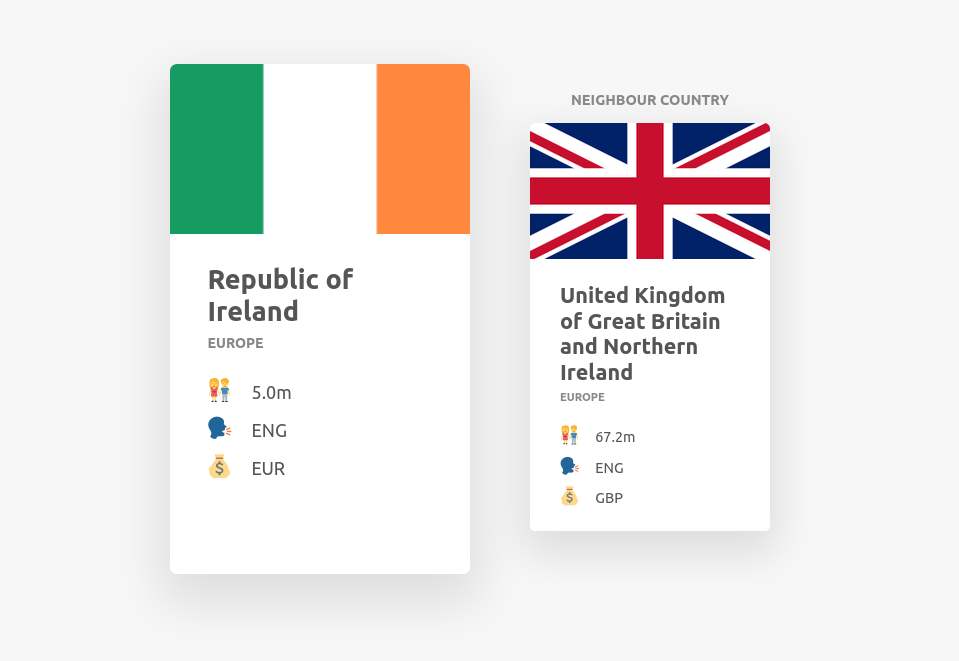
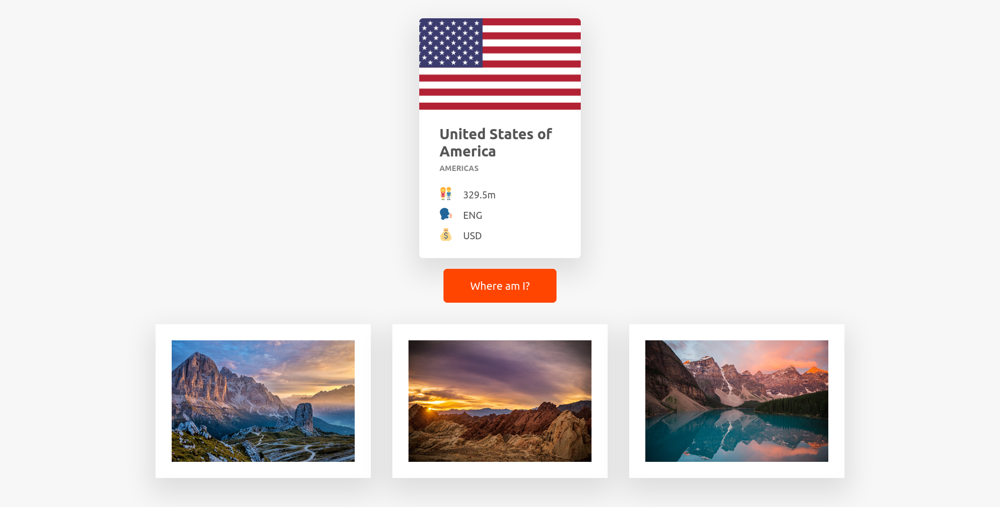

# AsyncCountries
Practice on making API calls using multiple methods. Starting with XMLHttpRequest. Working through Ajax/learning more about promises
 
1.) XHMLHttpRequest
 
2.) Promises and the Fetch API
 
3.) Chaining and handling errors + manual errors
 
4.) The Event Loop
 
5.) Promisifying
 
6.) Async/Await
 
7.) ES2020+ Promise Methods

